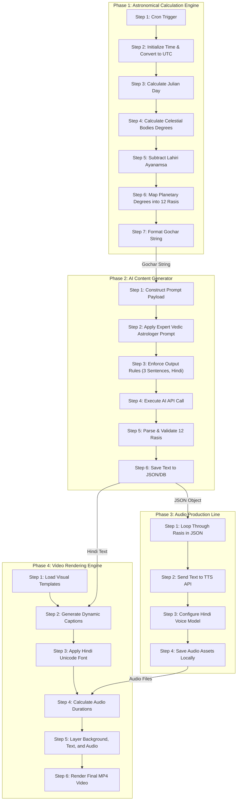

# Daily Rashi Bhavishya Execution Flow

Below is the visual flowchart representing the step-by-step execution pipeline for the Daily Rashi Bhavishya application.

```mermaid
graph TD
    %% Phase 1
    subgraph Phase1 ["Phase 1: Astronomical Calculation Engine"]
        direction TB
        P1S1["Step 1: Cron Trigger"] --> P1S2["Step 2: Initialize Time & Convert to UTC"]
        P1S2 --> P1S3["Step 3: Calculate Julian Day"]
        P1S3 --> P1S4["Step 4: Calculate Celestial Bodies Degrees"]
        P1S4 --> P1S5["Step 5: Subtract Lahiri Ayanamsa"]
        P1S5 --> P1S6["Step 6: Map Planetary Degrees into 12 Rasis"]
        P1S6 --> P1S7["Step 7: Format Gochar String"]
    end

    %% Phase 2
    subgraph Phase2 ["Phase 2: AI Content Generator"]
        direction TB
        P2S1["Step 1: Construct Prompt Payload"] --> P2S2["Step 2: Apply Expert Vedic Astrologer Prompt"]
        P2S2 --> P2S3["Step 3: Enforce Output Rules (3 Sentences, Hindi)"]
        P2S3 --> P2S4["Step 4: Execute AI API Call"]
        P2S4 --> P2S5["Step 5: Parse & Validate 12 Rasis"]
        P2S5 --> P2S6["Step 6: Save Text to JSON/DB"]
    end

    %% Phase 3
    subgraph Phase3 ["Phase 3: Audio Production Line"]
        direction TB
        P3S1["Step 1: Loop Through Rasis in JSON"] --> P3S2["Step 2: Send Text to TTS API"]
        P3S2 --> P3S3["Step 3: Configure Hindi Voice Model"]
        P3S3 --> P3S4["Step 4: Save Audio Assets Locally"]
    end

    %% Phase 4
    subgraph Phase4 ["Phase 4: Video Rendering Engine"]
        direction TB
        P4S1["Step 1: Load Visual Templates"] --> P4S2["Step 2: Generate Dynamic Captions"]
        P4S2 --> P4S3["Step 3: Apply Hindi Unicode Font"]
        P4S3 --> P4S4["Step 4: Calculate Audio Durations"]
        P4S4 --> P4S5["Step 5: Layer Background, Text, and Audio"]
        P4S5 --> P4S6["Step 6: Render Final MP4 Video"]
    end

    %% Phase Connections
    P1S7 -->|"Gochar String"| P2S1
    P2S6 -->|"JSON Object"| P3S1
    P2S6 -->|"Hindi Text"| P4S2
    P3S4 -->|"Audio Files"| P4S4
```
